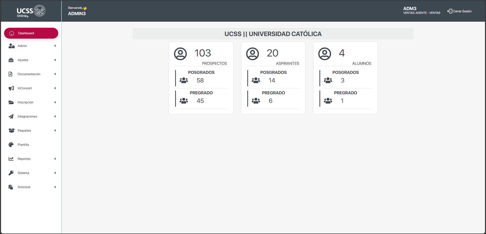

# Dashboard
{: .no_toc }

En esta sección podras encontrar estadisticas a nivel campus de las inscripciones y el estado de estas dentro de la plataforma.
{: .fs-6 .fw-300 }

## Tabla de contenido
{: .no_toc .text-delta }

1. TOC
{:toc}

---

## Configuración

Esta pantalla es generada mediante 2 confiruaciones basicas.

1.  Los campus mostrados son los que estan cofnigurados para el usuario con el que se tiene la sesión iniciada.
2.  Los niveles mostrados son los que estan configurados en el sistema.
