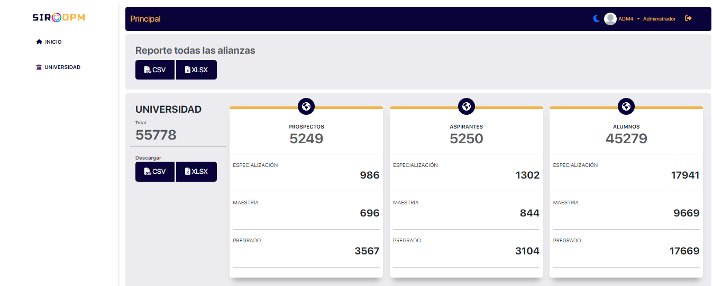
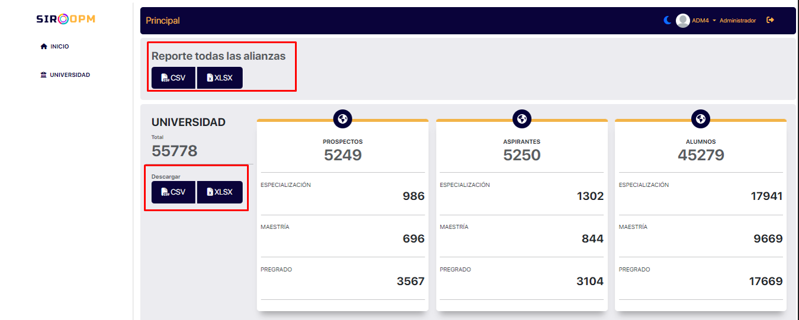

# Dashboard
{: .no_toc }

En esta sección podrás encontrar estadísticas a nivel campus de las inscripciones y el estado de estas dentro de la plataforma.
{: .fs-6 .fw-300 }

Imagen 1. Dashboard

## Reporte de inscripciones por estatus y nivel

En esta pantalla será posible la generación de un reporte general o un reporte de una alianza en específico en donde se muestra el total de las inscripciones por estatus y nivel. 

Imagen 2. Reportes del dashoboard